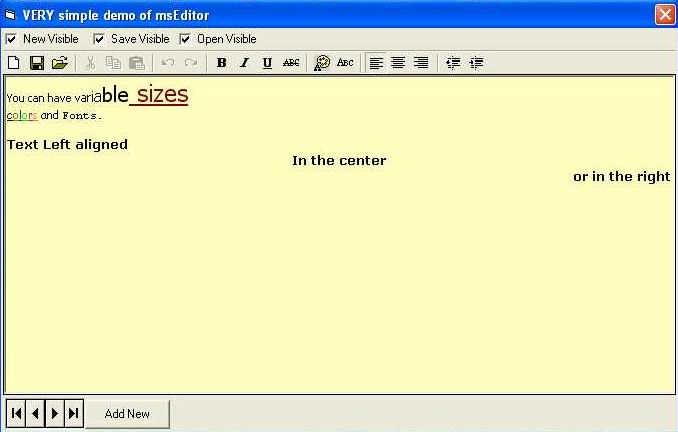



## Simple Editor ActiveX

### Description

I needed a simple msword compatible text editor in various parts of my system. So I sat down one night and designed this ActiveX control which you can 'throw' into any form. You can even bind it on a database. No technology breakthroughs here. Just lots of time saving when you want your users to have some control over what they write and you want to save them exactly as they want. It uses the richtextbox encapsulated as an activex and so you dont have to write any code every time you need a simple editor. Just throw it in.

You can enable or disable the "New', 'Open', and 'Save' buttons. Some of the code for the richtextbox comes from some other contributors of planet-source, but I dont remember from who.

Dont have to vote for it. I just hope that you find it useful.
 
### More Info
 

             |
---                |---
**Submitted On**   |2005-02-01 17:48:02
**By**             |[Makis Charalambous](https://github.com/Planet-Source-Code/PSCIndex/blob/master/ByAuthor/makis-charalambous.md)
**Level**          |Intermediate
**User Rating**    |5.0 (35 globes from 7 users)
**Compatibility**  |VB 6\.0
**Category**       |[Custom Controls/ Forms/  Menus](https://github.com/Planet-Source-Code/PSCIndex/blob/master/ByCategory/custom-controls-forms-menus__1-4.md)
**World**          |[Visual Basic](https://github.com/Planet-Source-Code/PSCIndex/blob/master/ByWorld/visual-basic.md)
**Archive File**   |[Simple\_Edi184689212005\.zip](https://github.com/Planet-Source-Code/makis-charalambous-simple-editor-activex__1-58628/archive/master.zip)

